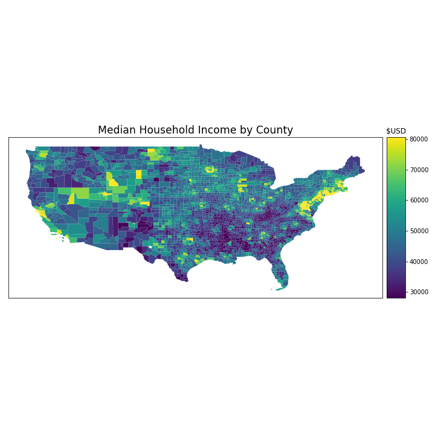
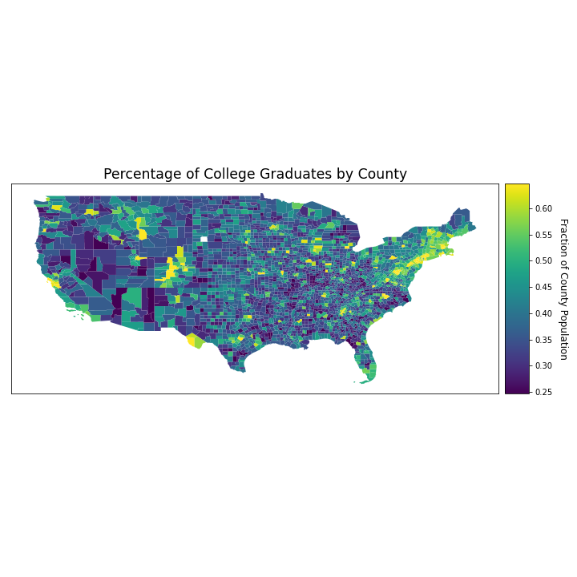
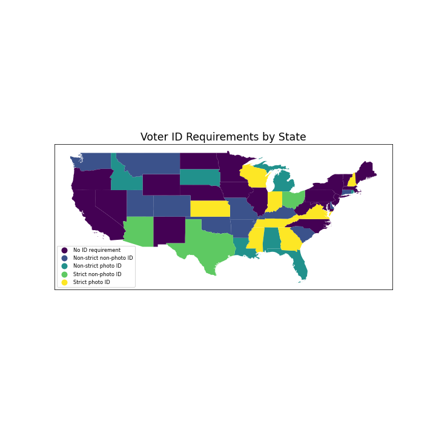

# Purpose

This is the final project for the course Machine Learning for Public Policy (UAPP 667) at the University of Delaware. The course instructor is Dr. Gregory Dobler. The team members associated with this project are Grace Ashley, Muhammet Furkan Karakaya, Desiderio Pilla, and Lan Yu. All are graduate students at UD.

# Introduction

## Background
Elections have a vital role on representative democracies. People choose their government officials through elections. In the Federalist papers, Alexander Hamilton, James Maidson, and Jon Jay explain the importance of democracy and representative republic to govern men in the United States [(The Federalist Papers)](https://www.congress.gov/resources/display/content/The+Federalist+Papers). Thomas Jefferson and the founding fathers declared, “government are instituted among Men, deriving their just Power from the Consent of the Governed” to protect citizens rights of life, liberty and the pursuit of happiness [(Declaration of Independence)](https://www.archives.gov/founding-docs/declaration-transcript).  The government obtains its power from voters through elections. Citizens evaluate parties and governments' performance and shape their voting choice. They use elections as a mean to enforcement of their views to the governors (Fiorina, 1981).  

Citizens’ participation in elections is as vital in the United States. Voter turnout, which is the percentage of the eligible voters who participate in an election, is very important for delegating representatives and expressing citizens’ opinion in politics [(Campbell, et al 1981)](https://books.google.com/books?hl=en&lr=&id=JeYUrs_GOcMC&oi=fnd&pg=PA18&dq=Campbell,+Angus,+Philip+E.+Converse,+Warren+E.+Miller,+and+Donald+E.+Stokes.+The+american+voter.+University+of+Chicago+Press,+1980.&ots=wGiCCHXpw7&sig=D8o88pfKXmonSJyPnRj6yAtBiis#v=onepage&q=Campbell%2C%20Angus%2C%20Philip%20E.%20Converse%2C%20Warren%20E.%20Miller%2C%20and%20Donald%20E.%20Stokes.%20The%20american%20voter.%20University%20of%20Chicago%20Press%2C%201980.&f=false). Voter turnout is also considered a significant indicator of a healthy democracy [(Essays, UK., 2018)](<https://www.ukessays.com/essays/politics/the-importance-of-voter-turnout-politics-essay.php?vref=1>). Studies show that electoral competitiveness, election type, demographics and voting laws play a crucial role on voter turnout [(Fair Vote)]( https://www.fairvote.org/what_affects_voter_turnout_rates). Demographic characteristics are one of the most important predictors of voter turnout. Characteristics such as race, sex, religion, income, education level etc., are highly correlated with political participation [(Brady, et al., 1995)](https://www.cambridge.org/core/journals/american-political-science-review/article/beyond-ses-a-resource-model-of-political-participation/CE74BA78807755F0A09E589D631EB03E). Competitiveness is also another important factor that appeals citizens’ attention on elections. Some elections seem to be less important than others for citizens. Voting laws suppress voter turnout, particularly among those who are demographically disadvantaged and lack the resources to overcome the maze of bureaucratic requirements [(Kelley, et al, 1967)](https://www.cambridge.org/core/journals/american-political-science-review/article/registration-and-voting-putting-first-things-first1/980C4232B8DF72D99DE1551FB2E660A6). Rosenstone and Wolfinger even argue that “registration is more difficult than voting.” [(Rosenstone & Wolfinger, 1978)](https://www.cambridge.org/core/journals/american-political-science-review/article/effect-of-registration-laws-on-voter-turnout/E9ED1FC9155FE2CB1874D67C40F4591F)

Demographics are a major player in the outcome of elections and its ability to influence elections depends partly on the size of the group of people and how many voters from that group turn out to vote [(Hudak & Stenglein, 2020)](https://www.brookings.edu/blog/fixgov/2016/09/13/how-demographic-changes-are-transforming-u-s-elections/). Analyses of turnout rates among minority populations show why political power among communities of color has increased. It has been reported that turnout rates among African Americans, Latinos, and Asian Americans have increased considerably since the year 2000 [(Hudak & Stenglein, 2020)](https://www.brookings.edu/blog/fixgov/2016/09/13/how-demographic-changes-are-transforming-u-s-elections/).  Political strategists have therefore started tailoring messages to such groups in order to gain an electoral advantage. One group that must not be taken for granted is the Minority Millennial group. A survey conducted by The Black Youth Project at the University of Chicago reported millennials’ views current issues and the 2016 presidential candidates [(Hudak & Stenglein, 2020)](https://www.brookings.edu/blog/fixgov/2016/09/13/how-demographic-changes-are-transforming-u-s-elections/).  It was revealed that while millennials and communities of color tend to favor Democrats, especially in presidential elections, millennials should not be automatically counted as a single voting block. Additionally, although minority millennials do favor the Democratic presidential candidate by a substantial margin (a characteristic that is true for African Americans, Latinos, and Asian Americans, 18 to 30 years of age) a large number of those polled also considering not voting the upcoming upcoming election (at the time of the survey was conducted).

Demographic shifts over the years have caused huge disruptions in the political world.  Knight identified four of the most significant demographic trends shaping politics today [(Knight, 2020)](https://www.axios.com/demographic-shifts-what-matters-2020-424161bf-1e6e-4da9-b2b2-9a6b2b2099fa.html). The first shift is the liberal youth revolution; Millennial and Gen Z Americans have been seen to be more sympathetic to the Democratic Party as they mature into adulthood, according to the [Pew Research Center](https://www.pewresearch.org/wp-content/uploads/sites/4/legacy-pdf/11-3-11-Generations-Release.pdf). If Millennial and Gen Z Americans are incentivized to get to the polls, Democrats could gain political power in the near future. The next shift is the growing voting power of the older generation. The fraction of the electorate from older, more conservative generations is increasing as the massive baby boomer generation ages and life expectancy rises. In addition to this, the older generation has expendable income to invest in political candidates and parties. Similarly, retirement-aged Americans have also been seen to outvote young people. The third important shift is the shrinkage of white America. Reports based on census data show that since 2010, non-Hispanic white people have lost their majority in 32 U.S. counties. The last shift is “The great rural exodus”. The fraction of people living in Rural America is currently declining. The percentage of Americans living in urban areas is rising rapidly as the population grows. This is evidenced by the roughly 3.3% increase in people who live in urban areas, as compared to 2000. States with the highest population density (New Jersey, Rhode Island, Massachusetts, Connecticut and Maryland) tend to be Democratic and coastal according to the [World Population Review (2020)](https://data.worldbank.org/indicator/SP.URB.TOTL.IN.ZS?end=2018&locations=US&start=1970).

[Voter ID laws](https://en.wikipedia.org/wiki/Voter_ID_laws_in_the_United_States) in the United States are laws that require a person to provide some form of official identification before they are permitted to register to vote, receive a ballot for an election, or to actually vote in elections in the United States”. Usually, the requirements of voter ID vary state by state. Voter ID laws can be categorized into five groups. The first split is made based on whether a state asks for a photo ID (e.g,. Driver's license) or whether it accepts IDs without a photo (e.g,. bank statement). Second, the laws can be divided by what actions are taken for voters who do not have ID. If a voter fails to show the ID that is asked for by law, states provide alternatives, which fit two categories, non-strict and strict. 

For the “non-strict” states, polls will be counted without further action on the part of the voter (e.g,. Poll workers may be permitted to vouch for the voter). For some “strict” states, unless voters without acceptable identification take addtional steps after Election Day, their ballot may not be counted. For instance, some voters required to return to an election office within a few days after the election and present an acceptable ID. The NCSL [(National Conference of State Legislatures)](https://www.ncsl.org/research/elections-and-campaigns/voter-id.aspx) has categorized the severity of these laws at five levels: Photo ID required (strict); Photo ID required (non-strict); Non-photo ID required(strict); Non-photo ID requested (non-strict); No ID required to vote at ballot box. 

Recently, many researchers have analyzed the relationship between the severity of vote laws and voter turnout([Augugliaro, 2018](https://www.wired.com/story/voter-id-law-algorithm/)). Most of the researchers are focusing on their relationship with demographics and voter turnout. A hotly debated subject is using voter ID laws to reduce the number of minority voters, particularly African Americans, who register to vote and participate in elections [(Primus, 2010)](https://www.jstor.org/stable/20775015?seq=1#metadata_info_tab_contents). [Henninger, Meredith and Morse (2018)](https://esra.wisc.edu/papers/HMM.pdf) state that voter ID laws can disproportionately disenfranchise minority voters, as non-white voters are more likely than white voters to lack photo ID. Also, a 2012 study in the city of Boston indicates that non-white voters are more likely to be asked for ID [(Rachael et al., 2014)]( https://papers.ssrn.com/sol3/papers.cfm?abstract_id=1625041). However, [Alvarez et al., (2007)]( https://dspace.mit.edu/handle/1721.1/96594) has found that the stricter voter identification requirements depress turnout to a greater extent for less educated and lower income populations, regardless of ethnicity. 

On the other hand, the impact of voter identification requirements on voter ID turnout rate in the United States has received little academic attention [Alvarez et al., (2007)]( https://dspace.mit.edu/handle/1721.1/96594). There are only a handful of recent studies on this subject. For example, a small increase in democratic turnout will be caused by new voter ID laws; meaning, the strong negative reaction to voter ID Laws among Democratic constituencies could increase the Democratic turnout [Milyo, 2007](https://www.in.gov/sos/elections/files/EffectsPhotographicIdentificationVoter_-_Jeffrey_Milyo.pdf); [Valentino, 2016)](https://www.worldcat.org/title/political-psychology-journal-of-the-international-society-of-political-psychology/oclc/66950841). Also, in 2019, by using Rhodes Island as a case study, [Esposite et al., (2019)](https://www.nber.org/papers/w25503) found that the implementation of photo ID led to a decline in turnout for those who did not have driver licenses.
 
Overall, after the 2010 election, 25 states have implemented new restrictions, but these have been the subject of significant debate [(Brennan Center for Justice, 2019)](https://www.brennancenter.org/our-work/research-reports/new-voting-restrictions-america). The proponents state it will decrease voter fraud and discourage non-citizens from voting, increase public confidence in the integrity of democracy, and ensure a one-vote-per-person system [(Spakocsky, 2012)](https://www.usnews.com/debate-club/should-photo-id-be-required-to-vote/voter-id-laws-protect-the-integrity-of-our-democracy). The opponents argue that it will disproportionately disadvantage black and Latino voters, the elderly, people with past criminal convictions, and students [(Rocha & Matsubayashi, 2014)](https://pdfs.semanticscholar.org/ebae/a2e713c62f19004c57894fd38398b998960e.pdf?_ga=2.221962072.1117407631.1585975384-1554961354.1585975384); They also contend that voting fraud is so rare that requiring an ID is unnecessary and costly [(Lott, 2006)](https://papers.ssrn.com/sol3/papers.cfm?abstract_id=925611).

## Problem Statement

This project will investigate two primary issues relating to voting-eligible demographics, voter ID requirements and voter turnout. The scope of this study has been restricted to the 2016 presidential election, and while the results may not necessarily be extrapolated to all local and national elections, our goal is to provide an initial exploration of the correlations among demographics, voter ID laws, and voter turnout.

First, we will investigate how voter ID requirements differ among states with varying demographic populations:

* What is the relationship between minority populations and voter ID requirements?
* What is the relationship between education level and voter ID requirements?   
* What is the relationship between income and voter ID requirements? 
* What is the correlation between the proportion of young voters and voter ID requirements? 

These questions will be used to evaluate the correlation between demographic characteristics and voter ID laws. We will compare the average "strictness" of voter ID laws in states with different demographic makeups. If found to be statistically significant, this correlation can be used to inform discussions and decision making regarding the enacting of these laws more broadly. This study will seels to explore the space and examine whether or not certain demographic groups are subject to harsher voter ID laws than others.

Second, we will investigate how voter turnout rates are affected by demographic makeup at the county level:

* Do counties with higher minority populations have lower turnout rates?
* How does the voter turnout of counties with a higher percentage of college graduates compare to counties with a lower percentage of college graduates?
* How does median household income relate to election turnout rates?
* How does the voter turnout in counties with a younger voting-eligible population compare to voter turnout in counties with an older voting-eligible population?

These questions will address which demographic groups are less likely to vote within the context of the 2016 election, and explore how voter turnout scales with the demographics of a county as well as the extent to which voter turnout can be predicted by a county’s demographic composition.

Finally, we will combine these two lines of inquiry to assess whether voter ID requirements influence voter turnout rates. This study will explore the hypothesis that voter turnout is higher in states with more relaxed laws, and vice versa.

The following graphic is a representation of the hypothesized relationships

# Data Exploration

## Data Description

All of the datasets in this research are publicly available. The geospatial files, which includes shapefiles for each county and states in the US, are  available in the [Census Bureau’s MAF/TIGER](https://www.census.gov/geographies/mapping-files/time-series/geo/carto-boundary-file.html) geographic database. For the states’ geospatial data, it includes each states’ name, FIPS code, and shapefiles. For the counties’ geospatial data, it has each county’s name, FIPS code, state FIPS code, and shapefiles. The Census Bureau’s MAF/TIGER geographic database does not include demographic data but the FIPS code can be linked to other datasets. 

This will be used to visualize each characteristic of demographics in both state and county levels by merging geospatial data with demographics data.  We will also apply the same mechanism for the voter ID  and turnout datasets. Hence, we can map the demographic characteristics, the voter ID laws of the states, and the voter turnout rates at both county and state levels. 

Our [County Characteristics Data](https://data.world/data4democracy/election-transparency/workspace/file?filename=CountyCharacteristics.csv)  contains extensive demographic information for all counties in the US. The dataset is owned by [Data for Democracy](https://datafordemocracy.org/), "a group whose mission is to unite a functioning, enthusiastic network of individuals utilizing data to drive better choices and improve the world where we live". The dataset was compiled from the 2015 5-year [American Community Survey](https://www.census.gov/programs-surveys/acs), but also includes data from the [Bureau of Economic Analysis](https://www.bea.gov/), [Centers for Disease Control and Prevention](https://www.cdc.gov/), and [Bureau of Labor Statistics](https://www.bls.gov/). The demographic characteristics include education level, age, race, income, and employment status. When distinguishing race, we only kept the feature containing the population that is "not white"; All minority groups were lumped into a single feature. The education feature represents the proportion of the populatioin that has obtained at least a bachelor's degree.

Because the minimum voting age in the United States is 18, we limited our study to only those 18 and older. We have separated age into to three types:
* younger than 34
* people of ages 35 to 59
* people 60 and older

This is how we define "young people", "middle-aged people", and "older people", respectively. We chose these cutoffs to represent people of different lifestyles. Voters that are younger than 34 make up a large portion of the private renting population [(Hoolachan & McKee, 2015)](https://www-tandfonline-com.udel.idm.oclc.org/doi/full/10.1080/13676261.2016.1184241). At 35, the proportion of people who have never been married begins to plateau [(Santos & Weiss, 2016)](https://onlinelibrary.wiley.com/doi/abs/10.1111/iere.12163), signifying a change in lifestyle. Society tends to views a person's early 60s as a normal retiring age [(Ekerdt et al., 1989)](https://academic.oup.com/geronj/article-abstract/44/1/S28/537798), and thus we capped our "middle-aged" range there. It is important to note that the age ranges are not the same size and that the data is biased in this way. I.e., if a population distribution is uniform, it is more likely to have a higher population of middle aged people than young people, as the age range for what defines a middle-aged person is much larger (24 years compared to 16). This is acceptable as long as we confine our comparisons to county-to-county and not age group-to-age group. Meaning, we will only compare a county's proportion of young people to other counties's proportion of young voters, and not to the same county's proportion of middle-aged people.

The demographics dataset is one of the main pillars of the study. By using the demographics data, we will examine the relationships between demographic characteristics and voter ID laws, and demographics and voter turnout. In the first part of the study, we will test how [demographics affect voter ID requirements](https://www.jstor.org/stable/1953251). Briefly, we focus on particular demographic characteristics such as median household income, age, ethnicity, and education levels of counties in order to uncover if any particular demographic groups are required to adhere to stricter laws than other groups. We also investigate the relationships between demographics and voter turnout. Lastly, we examine the conjunctive correlations between demographics and voter ID laws, and voter turnout. 

The [voter ID requirements data](https://data.world/data4democracy/election-transparency/workspace/file?filename=States.csv) contains information regarding the voter ID law to which each state adheres. This dataset is also owned by [Data for Democracy](https://datafordemocracy.org/). As we mentioend before, according to [NCSL (National Conference of State Legislatures)](https://www.ncsl.org/research/elections-and-campaigns/voter-id.aspx), there are five types of voter ID law: Photo ID required (strict), Photo ID required (non-strict), Non-photo ID required(strict), Non-photo ID requested (non-strict), No ID required to vote at ballot box.

The voter ID requirements dataset contributes in two ways. First, we will examine the relationship between demographic characteristics and voter ID requirements. Therefore, we can observe if certain groups are subject to stricter measures than others at both the county and state level.  Second, we want to test the hypothesis that voter ID laws affect voter turnout. Do stricter Voter ID requirements supress voter turnout? Are certain demographic groups affected more by stricter ID laws?

Last but not least, our voter turnout data contains the election results for the 2016 presidential election. The [2016 US County Level Presidential Results Data](https://raw.githubusercontent.com/tonmcg/US_County_Level_Election_Results_08-16/master/2016_US_County_Level_Presidential_Results.csv) is owned by GitHub user [@tonmcg](https://github.com/tonmcg/US_County_Level_Election_Results_08-16/), founder and data scientist at emdata.ai. The data was originally collected by [TownHall](https://townhall.com/election/2016/president/), a conservative website that "pulls together political commentary and analysis from over 100 leading columnists and opinion leaders, research from 100 partner organizations, conservative talk-radio and a community of millions of grassroots conservatives." The data table was assembled using infomration from the Associated Press. In this data, we acquire the total votes for each counties. By merging the data according to the FIPS code, we calculate the voter turnout rate. The voter turnout rate is equal to the total ballots cast in the 2016 election for a given county divided by total eligible persons in 2016. 

The focus of the study is to understand the factors that affect voter turnout based on the 2016 presidential elections data in the United Statesat both the county and state levels. Thus, we can study how demographics and voter ID laws relate to voter turnout rates.

## Data Limitations

Our data is limited by few counts of missing information. This first limitation to note is that the value used for the count of young people is not exact. The original dataset only provided the population size of the age range `15-19`. However, the minimum voting age in the United States is 18. We made the assumption that the population of each age in that range is evenly distributed. 40% of this value (representing voting ages 18 and 19) were used in the counts of young people. We also assumed that all persons were legal citizens with the full right to vote; non-citizens, disenfranchised felons, or any other persons whom are ineligible to vote were not factored into our analysis, yet may be present in the data.

Another limitation of our analysis is that our voting eligible population metric comes from 2015, while the elction took place a year later. All permanent resident changes between counties during that year were not accounted for. Also, some youths that were 17 during the ACS period may have turned 18, a consideration that was not factored into our data. These potential sources of error create an uncertainty in our data and should be acknowledged with any conclusions resulting from this study.

Also, our election results data is aggregated at the county level, and no conditional results regarding specific demographic groups are present in our data. These data are typically gathered by extrapolating survey results, but do not exist concretely. This will limit our ability to make any concrete claims about individuals within demographic groups; we can only find correlations between counties that exhibit certain demogprahic features and the turnout.

Lastly, out of over 3000 counties a single county (Oglala Lakota County) in South Dakota is missing from the turnout dataset. Finally, Alaska only reported their election results at the state level; county-specific results are unavailable. For this reason, county-specific analyses cannot be conducted when considering the state of Alaska. As this is only one state in 51, we believe the effects on our results will be minimal.

## Data Visualizations

### Demographic Data

This figure shows the median household income of each county in the US. The wealthiest counties are those in the Northeastern corridor, as well as those surrounding the San Francisco Bay area and Midwest. Some counties in the midwest are also wealthier. However, the dark shade of the plot highlights how many counties across the US have median household incomes around $40,000 or lower, especially those in the southeast.

This figure shows the percentage of voting eligble persons in each county that hold either a Bachelor's or Master's degree. The most educated counties are those in the Northeastern corridor, as well as those in Colorado. Counties in the mountain states (Arizona, Idaho, Nevada, and Utah) appear to have lower rates of college education. Spread across the nation are counties with high rates, but they are sparse and few.

This figure shows the median age of each county in the US. This feature appears to be evenly distributed across the Eastern half of the country. Southern Florida, as well as the Northern most regions of the country, appear to have older populations. The mountain states appear to have younger populations.

This figure shows the percentage of voting eligible persons in each county that fall into distinct age categories. The largest category for nearly all counties is the `Age 35 to 59` bucket. The age range is the largest of the three, however. These figures are mostly evenly distributed.

This figure shows the unemployment rate of voting eligible persons in each county in the US. The unemployment rate tends to be higher in southern counties than in northern ones. Counties in the Boston and midwest regions have very low unemployment rates.

### Voter ID Requirements

This figure shows the voting ID laws that each state subscribes to. There are five classes of voting ID requirements. Most states touching the southern border of the US fall into the 3 strictes categories. The states adhering to the strictest ID policy are all on the eastern side of the country. The northeastern and western-most states make up the most voter-friendly states, as they have very relaxed ID policies.

This figure shows the number of states that fall into the different voting ID law categories. The plot shows that more states favor relaxed ID laws than strict ones.

### Voter Turnout Data

This figure shows the percentage of voting eligible persons that casted a ballot in the 2016 Presidential general election. The turnout rate was relatively high nationwide. Turnout rates in the counties along the southwestern counties were much lower than those in northern counties. Counties in the Great Plains, Colorado, and Boston regions had the highest turnout rates.

# Data Analysis

## Non-Machine Learning Analysis

### Classify "disadvantaged" counties

We will weight certain features to classify counties as either “disadvantaged” or “non-disadvantaged”.

The four features being used to create this "disadvantage index" are the following:
 * `1 - MedieanHous`: the smaller the median househole income, the more disadvantaged the county is.
 * `1 - CollegeDeg`: the smaller the percentage of residents with a college degree, the more disadvantaged the county is.
 * `MedianAge`: the larger the median age, the more disadvantaged the county is.
 * `not_white`: the larger the minority population, the more disadvantaged the county is.

 

 **Figure:** The above histogram shows the distribution of counties based on their `Disadvantage Index`. Larger values signify a county is more disadvantaged, and vice versa. The counties labeled "disadvantaged" are those with a disadvantage index in the 85th percentile and above, implying they are the most disadvantaged.

 **Figure:** The above figure shows that there are significant differences between disadvantaged and non-disdvantaged counties in the four major demographic categories. However, this is to be expected, as by definition the "disadvantaged" counties are taken from the lowest 15th percentile in each category.

